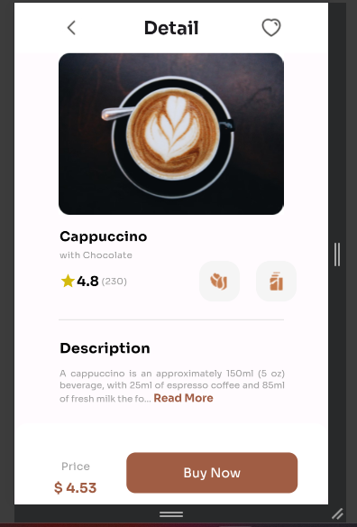
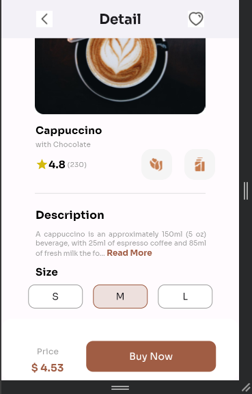

# Flutter Project -  Food Recipe





This Flutter project is a single-page mobile application that showcases an order page. 
The order page has three sections, the product image and details section, the product description section and the order placement section.
This project is broken down into several widget components and then used in the main widget.

## Table of Contents

- [Flutter Application- Cappuccino](#cappuccino)
  - [Table of Contents](#table-of-contents)
  - [Objectives](#objectives)
  - [Features](#features)
  - [Getting Started](#getting-started)
    - [Prerequisites](#prerequisites)
    - [Installation](#installation)
    - [Running the Application](#running-the-application)
  - [Usage](#usage)
  - [Styling](#styling)
  - [Resources](#resources)

## Objectives

- **Personal Expression:** To create a static flutter app.


## Features

- **LandingPage:** It's made up of several widget component broken down into smaller chunks and then use inside the main

## Getting Started

### Prerequisites

-  Install the Flutter SDK, which includes the Flutter framework and the Dart programming language. You can download the Flutter SDK from the official Flutter website. [Flutter](https://flutter.dev/) 
- Development Environment: Set up your development environment. This typically involves installing an integrated development environment (IDE) or a code editor. Popular options include:

- Android Studio: An IDE developed by Google, which provides a comprehensive environment for Flutter development.
- Visual Studio Code (VS Code): A lightweight code editor with excellent Flutter support through extensions like the "Flutter" and "Dart" extensions.
- Android Emulator or iOS Simulator: You need an Android emulator (such as the one provided by Android Studio) or an iOS simulator (for macOS users) to test your Flutter app on virtual devices. Alternatively, you can use a physical Android or iOS device connected to your development machine.
- Android SDK and iOS Development Tools:

 .For Android development, you need the Android SDK installed. Android Studio typically handles this installation for you.
 .For iOS development (macOS only), you need Xcode installed, which includes the necessary iOS development tools.
- Flutter and Dart Plugins: If you're using Android Studio or VS Code, make sure you have the Flutter and Dart plugins/extensions installed. These plugins provide features such as code highlighting, completion, debugging, and project templates.

  ```bash
 flutter create . (since we already clone the repo)
  ```

## Installation

1. Clone the repository:

   ```bash
   git clone https://github.com/wptechprodigy/capuccino.git
   ```

2.   ```bash
     git remote set-url origin <remote link> to change the remote origin
     ```


3. Navigate to the project folder:

   ```bash
   cd capuccino
   ```

### Running the Application

```bash
flutter run
```

## Usage

Explore the cappuccino order page.

## Styling

The application is styled for a visually appealing experience. Creative layouts, images, and styles enhance the overall user interface.


## Resources

- [Flutter Official Documentation](https://flutter.dev/)
